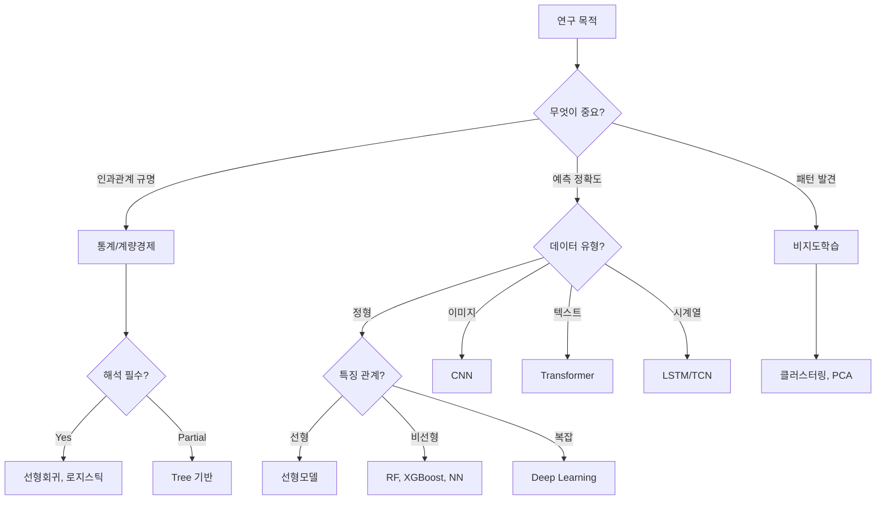

## 학습목표

- 연구방법론의 복잡도 진화 이해
- AI를 활용한 적절한 분석 방법 선택
- 생성형 AI를 통한 분석 코드 생성 및 실행

---

## Part 1: 연구방법론의 복잡도 진화

### 1. 복잡도의 역사적 진화

#### 1.1 1세대 (1900-1980): 수식으로 풀 수 있는 해

```
y = β₀ + β₁x + ε
```

- 특징: 손으로 계산 가능
- 파라미터: ~10개
- 해석: "X가 1 증가하면 Y가 β₁만큼 변화"
- 대표 방법: t-test, ANOVA, 선형회귀

#### 1.2 2세대 (1980-2000): 비선형 모델

```
y = f(x) where f is nonlinear
```

- 특징: 컴퓨터 필요
- 파라미터: ~100개
- 해석: 부분적 가능
- 대표 방법: 로지스틱 회귀, SVM

#### 1.3 3세대 (2000-2010): 앙상블 방법

```
y = Σᵢ wᵢ·fᵢ(x)
```

- 특징: 여러 모델 결합
- 파라미터: ~1,000개
- 해석: 특징 중요도
- 대표 방법: Random Forest, XGBoost

#### 1.4 4세대 (2010-현재): 심층학습

```
y = f_n(f_{n-1}(...f_1(x)))
```

- 특징: 자동 특징 추출
- 파라미터: 수백만~수십억개
- 해석: Black Box
- 대표 방법: CNN, LSTM, Transformer

---

## Part 2: AI를 활용한 방법론 선택

### 1. 의사결정 트리



### 2. ChatGPT/Claude 활용 프롬프트

#### 2.1 방법론 선택 프롬프트

```markdown
# 연구 특성
- 목적: [인과관계/예측/패턴발견]
- 데이터 유형: [정형/이미지/텍스트/시계열]
- 패턴 복잡성: [선형/비선형/상호작용]
- 해석 필요성: [필수/선호/불필요]
- 제약사항: [실시간/리소스/규제]

# 질문
어떤 분석 방법을 사용해야 할까요? 
각 방법의 장단점을 설명해주세요.
```

#### 2.2 실제 예시

```python
prompt = """
의료 데이터 분석을 하려고 합니다.
- 데이터: 환자 500명, 특징 20개 (나이, 혈압, 검사결과 등)
- 목적: 6개월 내 재입원 예측
- 제약: 의사에게 설명 가능해야 함

추천 방법론과 이유를 설명해주세요.
"""

# AI 응답 예시
"""
추천 방법론: 
1순위 - 로지스틱 회귀 또는 의사결정나무
2순위 - Random Forest (특징 중요도 제공)

이유:
1. 샘플 크기(500)가 딥러닝에는 부족
2. 의료진 설명 필요 → 해석 가능 모델 필수
3. 특징 수(20)가 적당 → 과적합 위험 낮음
"""
```

---

## Part 3: AI를 활용한 코드 생성

### 1. 단계별 코드 생성 전략

#### 1.1 데이터 탐색

```python
# 프롬프트
"의료 데이터 EDA 코드를 작성해줘. 
결측치 확인, 분포 시각화, 상관관계 분석 포함"

# AI가 생성한 코드
import pandas as pd
import numpy as np
import matplotlib.pyplot as plt
import seaborn as sns

def medical_data_eda(df):
    # 1. 기본 정보
    print("=== 데이터 개요 ===")
    print(df.info())
    print("\n=== 기초 통계 ===")
    print(df.describe())
    
    # 2. 결측치 확인
    print("\n=== 결측치 현황 ===")
    missing = df.isnull().sum()
    missing_pct = (missing / len(df)) * 100
    missing_df = pd.DataFrame({
        'Missing': missing,
        'Percentage': missing_pct
    })
    print(missing_df[missing_df['Missing'] > 0])
    
    # 3. 시각화
    fig, axes = plt.subplots(2, 2, figsize=(12, 10))
    
    # 분포 확인
    for i, col in enumerate(df.select_dtypes(include=[np.number]).columns[:4]):
        ax = axes[i//2, i%2]
        df[col].hist(ax=ax, bins=30)
        ax.set_title(f'Distribution of {col}')
    
    plt.tight_layout()
    return missing_df
```

#### 1.2 모델 구축

```python
# 프롬프트
"로지스틱 회귀와 Random Forest를 비교하는 코드 작성.
교차검증, ROC 커브, 특징 중요도 포함"

# AI가 생성한 코드
from sklearn.model_selection import cross_val_score, StratifiedKFold
from sklearn.linear_model import LogisticRegression
from sklearn.ensemble import RandomForestClassifier
from sklearn.metrics import roc_curve, auc, classification_report
from sklearn.preprocessing import StandardScaler

def compare_models(X, y):
    # 데이터 준비
    scaler = StandardScaler()
    X_scaled = scaler.fit_transform(X)
    cv = StratifiedKFold(n_splits=5, shuffle=True, random_state=42)
    
    # 모델 정의
    models = {
        'Logistic Regression': LogisticRegression(max_iter=1000),
        'Random Forest': RandomForestClassifier(n_estimators=100, random_state=42)
    }
    
    results = {}
    
    for name, model in models.items():
        # 교차검증
        if name == 'Logistic Regression':
            scores = cross_val_score(model, X_scaled, y, cv=cv, scoring='roc_auc')
        else:
            scores = cross_val_score(model, X, y, cv=cv, scoring='roc_auc')
        
        results[name] = {
            'AUC_mean': scores.mean(),
            'AUC_std': scores.std(),
            'scores': scores
        }
        
        print(f"{name}:")
        print(f"  AUC: {scores.mean():.3f} (+/- {scores.std():.3f})")
    
    return results
```

### 2. 실전 활용 시나리오

#### 2.1 시나리오 1: 해석이 중요한 경우

```python
# ChatGPT에게 요청
prompt_interpretable = """
의료진에게 예측 근거를 설명해야 하는 모델 개발
- 목표: 당뇨 합병증 위험도 예측
- 특징: 검사 수치, 생활습관, 병력
- 요구사항: 각 요인의 영향력 설명 필요

적절한 방법과 Python 코드 제공해줘.
"""

# 추천 결과
"""
추천: 로지스틱 회귀 또는 의사결정나무
이유: 
- 계수/규칙을 통한 직접적 해석 가능
- 의료진이 이해하고 신뢰할 수 있는 모델
- SHAP으로 개별 예측 설명 가능
"""
```

#### 2.2 시나리오 2: 복잡한 비선형 패턴

```python
# Claude에게 요청
prompt_complex = """
다양한 검사 결과 간 복잡한 상호작용이 있는 데이터
- 목표: 치료 반응 예측
- 특징: 유전자 발현, 단백질 농도, 임상 지표
- 패턴: 특징 간 비선형 상호작용 존재

전체 파이프라인 코드 작성해줘.
"""

# 추천 결과
"""
추천: XGBoost 또는 Neural Network
이유: 
1. 복잡한 상호작용 자동 학습
2. 비선형 패턴 포착 능력
3. Feature interaction 처리 우수
"""
```

---

## Part 4: 실습 - 복잡도별 모델 비교

### 1. 동일 데이터로 복잡도 비교

```python
# 실습 코드: 모든 세대별 모델 한번에 비교
import numpy as np
import pandas as pd
from sklearn.datasets import make_classification
from sklearn.model_selection import train_test_split
import time

# 데이터 생성
X, y = make_classification(n_samples=1000, n_features=10, 
                          n_informative=6, random_state=42)
X_train, X_test, y_train, y_test = train_test_split(X, y, test_size=0.2)

# 결과 저장
results = []

# 1세대: 로지스틱 회귀
from sklearn.linear_model import LogisticRegression
start = time.time()
lr = LogisticRegression()
lr.fit(X_train, y_train)
results.append({
    'Model': 'Logistic Regression',
    'Generation': '1세대',
    'Parameters': 11,
    'Training_Time': time.time() - start,
    'Accuracy': lr.score(X_test, y_test),
    'Interpretability': '매우 높음'
})

# 2세대: SVM
from sklearn.svm import SVC
start = time.time()
svm = SVC()
svm.fit(X_train, y_train)
results.append({
    'Model': 'SVM',
    'Generation': '2세대', 
    'Parameters': len(svm.support_vectors_),
    'Training_Time': time.time() - start,
    'Accuracy': svm.score(X_test, y_test),
    'Interpretability': '보통'
})

# 3세대: Random Forest
from sklearn.ensemble import RandomForestClassifier
start = time.time()
rf = RandomForestClassifier(n_estimators=100)
rf.fit(X_train, y_train)
results.append({
    'Model': 'Random Forest',
    'Generation': '3세대',
    'Parameters': sum(tree.tree_.node_count for tree in rf.estimators_),
    'Training_Time': time.time() - start,
    'Accuracy': rf.score(X_test, y_test),
    'Interpretability': '낮음'
})

# 결과 출력
df_results = pd.DataFrame(results)
print(df_results)
```

### 2. AI 활용 실습

#### 2.1 실습 1: 방법론 선택

```python
# 학생 실습 과제
"""
1. 자신의 데이터 특성 정리
2. ChatGPT/Claude에 질문
3. 추천받은 방법론 2-3개 구현
4. 성능 비교 및 선택 근거 작성
"""

template = """
# 내 연구 특성
- 도메인: [예: 헬스케어/금융/마케팅]
- 연구 목적: [인과관계 규명/예측/탐색]
- 데이터 유형: [정형/이미지/텍스트/시계열]
- 패턴 특성: [선형/비선형/상호작용 많음]
- 해석 필요성: [필수/권장/불필요]
- 특수 요구사항: [실시간 처리/규제 준수/기타]

# AI에게 질문
위 조건에서 최적의 분석 방법 3개를 추천하고
각각의 장단점을 설명해주세요.
"""
```

#### 2.2 실습 2: 코드 생성

```python
# 단계별 코드 생성 실습
steps = [
    "1. 데이터 로드 및 EDA",
    "2. 전처리 (결측치, 스케일링)",
    "3. 모델 구축 (선택한 방법론)",
    "4. 하이퍼파라미터 튜닝",
    "5. 평가 및 시각화"
]

for step in steps:
    prompt = f"""
    {step} 단계의 Python 코드를 작성해줘.
    - 데이터: 의료 데이터 (분류 문제)
    - 모델: [학생이 선택한 모델]
    - 포함사항: 에러 처리, 주석, 모듈화
    """
    print(f"\n=== {step} ===")
    print(prompt)
    # AI가 코드 생성
```

---

## Part 5: 생성형 AI 시대의 연구방법론

### 1. 패러다임 변화

#### 1.1 Before AI (전통적 접근)

```
연구자 → 통계 이론 학습 → 코딩 → 디버깅 → 결과
         (수개월)      (수주)  (수일)   
```

#### 1.2 With AI (AI 협업)

```
연구자 → AI와 대화 → 코드 생성 → 검증 → 결과
         (수분)      (수초)    (수시간)
```

### 2. AI 활용 Best Practices

#### 2.1 DO (권장사항)

- **검증 우선**: AI 생성 코드는 항상 검증
- **단계적 접근**: 전체보다 부분별 생성
- **도메인 지식 활용**: AI는 도구, 판단은 연구자
- **프롬프트 개선**: 구체적이고 명확한 요청

#### 2.2 DON'T (주의사항)

- **맹목적 신뢰**: 결과 무비판적 수용
- **블랙박스 방치**: 이해 없는 사용
- **과도한 복잡성**: 필요 이상의 복잡한 모델
- **재현성 무시**: 프롬프트/버전 기록 누락

---

## 핵심 정리

### 복잡도 선택 가이드

|고려사항|단순 모델 선택|복잡 모델 선택|AI 활용|
|---|---|---|---|
|**인과관계 규명**|통계적 방법||가설 생성, 변수 선택|
|**해석 필수**|선형모델, Tree||결과 설명, SHAP|
|**비선형 패턴**||앙상블, DL|아키텍처 설계|
|**비정형 데이터**||Deep Learning|전처리, 증강|
|**예측 정확도 우선**||XGBoost, NN|하이퍼파라미터|
|**실시간 처리**|선형모델||최적화 코드|

### 기억할 문장

> "The best model is not the most complex one,  
> but the simplest one that works."
> 
> "AI는 연구를 대체하는 것이 아니라,  
> 연구자를 더 강력하게 만드는 도구다."