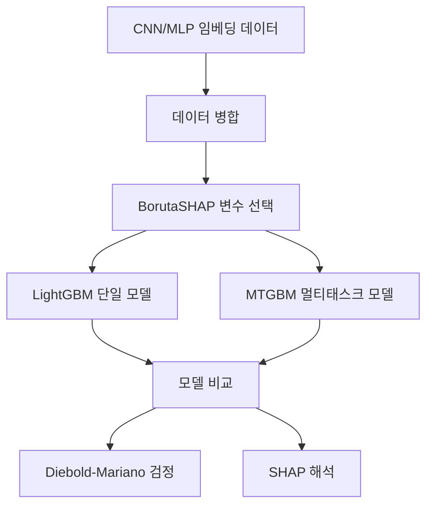
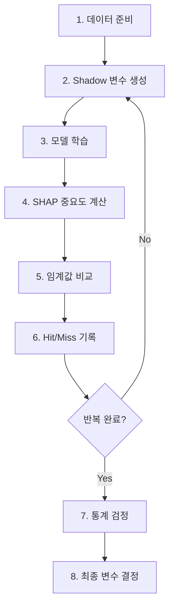
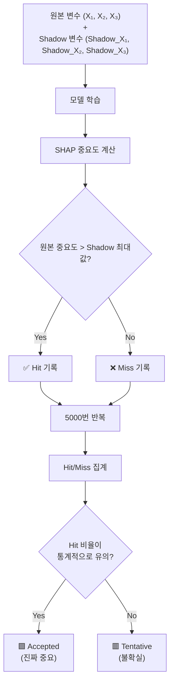
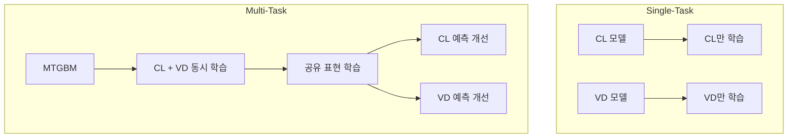

# MTGBM 모델 훈련 파이프라인

> **목적**: 동물 약동학 데이터와 분자 임베딩을 활용하여 인간의 Clearance(CL)와 Volume of Distribution(VDss)를 예측하는 Multi-Task Gradient Boosting Machine 모델 개발

---

## 📋 전체 흐름 요약



---

## 🎯 1. 핵심 아이디어

### 왜 Multi-Task Learning인가?

| 접근법 | 설명 | 장단점 |
|--------|------|--------|
| **Single-Task** | CL, VD 각각 별도 모델 | 단순하지만 관계성 무시 |
| **Multi-Task** | CL, VD 동시 예측 | 두 타겟 간 상관관계 활용 |

**CL과 VD는 약리학적으로 연관됨**:
- 둘 다 약물의 체내 분포와 제거에 관련
- 동일한 분자 특성에 영향받음
- 함께 학습하면 **공유 정보**를 활용 가능

> [!tip] 핵심 원리
> MTGBM은 하나의 트리가 두 타겟을 동시에 예측하도록 학습합니다.
> 이를 통해 CL을 예측할 때 VD 정보도 함께 활용하게 됩니다.

---

## 📊 2. 입력 데이터 구성

### 데이터 병합

```
CNN 임베딩 (581 × 21) + MLP 임베딩 (581 × 21)
                    ↓
           최종 데이터 (581 × 25)
```

### 변수 유형

| 카테고리 | 변수 예시 | 의미 |
|----------|----------|------|
| **동물 PK** | `rat_CL_mL_min_kg`, `dog_VDss_L_kg` | 동물 실험 약동학 |
| **단백결합** | `human_fup`, `rat_fup`, `dog_fup` | 혈장 비결합 분율 |
| **물리화학** | `pKa_Acid`, `pKa_base` | 산/염기 해리상수 |
| **CNN 임베딩** | `cnn_vec1_CL`, `cnn_vec2_VD` | 분자 이미지 특징 |
| **MLP 임베딩** | `mlp_vec1_CL`, `mlp_vec2_VD` | 분자 수치 특징 |

---

## 🔍 3. BorutaSHAP 변수 선택

### 3.1 BorutaSHAP이란?

**BorutaSHAP**은 두 가지 기법을 결합한 변수 선택 알고리즘입니다:

```
BorutaSHAP = Boruta (변수 선택 프레임워크) + SHAP (중요도 측정 도구)
```

| 구성 요소 | 역할 | 비유 |
|-----------|------|------|
| **Boruta** | "어떤 절차로 변수를 선택할까?" | 시험 방식 |
| **SHAP** | "변수 중요도를 어떻게 측정할까?" | 채점 방법 |

> [!info] 기존 Boruta의 한계
> 원래 Boruta는 Random Forest의 **Gini Importance**를 사용하는데, 이는 **연속형 변수나 카디널리티가 높은 변수에 편향**되는 문제가 있습니다. BorutaSHAP은 이를 SHAP 값으로 대체하여 더 **공정하고 해석 가능한** 중요도를 계산합니다.

---

### 3.2 전체 흐름



---

### 3.3 Step 1: Shadow 변수 생성

원본 변수를 **행(샘플) 단위로 무작위 셔플**하여 Shadow 변수 생성:

```
원본 데이터:
         X₁    X₂    X₃       Y(타겟)
샘플1    0.5   1.2   3.4  →   10
샘플2    0.7   0.9   2.1  →   15
샘플3    0.3   1.5   4.2  →   8
샘플4    0.9   0.6   1.8  →   20

Shadow 변수 (섞은 것):
         Shadow_X₁  Shadow_X₂  Shadow_X₃
샘플1    0.9        0.6        1.8       →   10 (엉뚱한 조합)
샘플2    0.3        1.5        2.1       →   15 (엉뚱한 조합)
샘플3    0.7        0.9        4.2       →   8  (엉뚱한 조합)
샘플4    0.5        1.2        3.4       →   20 (엉뚱한 조합)
```

**핵심**: Shadow 변수는 Y와 **아무 관계 없음** → "우연에 의한 중요도"의 기준이 됨

---

### 3.4 Step 2-3: 합쳐서 모델 학습

```
학습 데이터 (원본 + Shadow):

         X₁   X₂   X₃   Shadow_X₁  Shadow_X₂  Shadow_X₃    Y
샘플1    0.5  1.2  3.4    0.9        0.6        1.8        10
샘플2    0.7  0.9  2.1    0.3        1.5        2.1        15
샘플3    0.3  1.5  4.2    0.7        0.9        4.2        8
샘플4    0.9  0.6  1.8    0.5        1.2        3.4        20

→ LightGBM 모델 학습
```

---

### 3.5 Step 4: SHAP 중요도 계산

#### SHAP이란?

**SHAP (SHapley Additive exPlanations)**은 게임 이론의 **Shapley Value**를 머신러닝에 적용한 것입니다.

| 게임 이론 | 머신러닝 (SHAP) |
|-----------|-----------------|
| 플레이어 (A, B, C) | 변수 (X₁, X₂, X₃) |
| 총 수익 | 예측값 |
| 각자의 기여도 | 각 변수의 기여도 |
| "공정한 분배" | "공정한 설명" |

#### 기여도 계산 원리

**"이 변수가 있을 때와 없을 때 예측이 얼마나 달라지는가?"**를 모든 조합에서 측정:

```
X₁의 기여도 계산 예시:

경우 1: 아무것도 없음 → X₁ 추가
  f(없음) = 3.0억
  f(X₁) = 3.8억
  변화 = +0.8억

경우 2: X₂만 있음 → X₁ 추가
  f(X₂) = 3.5억
  f(X₁, X₂) = 4.5억
  변화 = +1.0억

경우 3: X₃만 있음 → X₁ 추가
  f(X₃) = 3.2억
  f(X₁, X₃) = 4.2억
  변화 = +1.0억

경우 4: X₂, X₃ 있음 → X₁ 추가
  f(X₂, X₃) = 4.0억
  f(X₁, X₂, X₃) = 5.0억
  변화 = +1.0억

→ 가중 평균 = X₁의 SHAP 값
```

#### 변수 중요도 = |SHAP|의 평균

```python
# SHAP 값 계산
explainer = shap.TreeExplainer(model)
shap_values = explainer.shap_values(X)

# 중요도 = |SHAP|의 열별 평균
importance = np.abs(shap_values).mean(axis=0)
```

```
|shap_values|:
            X₁      X₂      X₃     Shadow_X₁  Shadow_X₂
샘플1      0.8     0.3     0.1       0.05       0.02
샘플2      0.5     0.4     0.2       0.08       0.03
샘플3      0.9     0.2     0.3       0.02       0.01
샘플4      0.6     0.5     0.1       0.04       0.06
━━━━━━━━━━━━━━━━━━━━━━━━━━━━━━━━━━━━━━━━━━━━━━━━━━━━
평균       0.70    0.35   0.175     0.0475     0.03
           ↑                         ↑
       원본 중요도              Shadow 중요도
```

---

### 3.6 Step 5-6: 비교 및 Hit/Miss 기록

```
기준: Shadow 최대값 = max(0.0475, 0.03) = 0.0475

X₁ (0.70)  > 0.0475 → ✅ Hit
X₂ (0.35)  > 0.0475 → ✅ Hit
X₃ (0.175) > 0.0475 → ✅ Hit
```

---

### 3.7 Step 7: 반복 (5000회)

**매번 Shadow를 새로 섞고, 다시 비교**

```
반복 1: X₁ Hit ✅, X₂ Hit ✅, X₃ Hit ✅
반복 2: X₁ Hit ✅, X₂ Hit ✅, X₃ Miss ❌
반복 3: X₁ Hit ✅, X₂ Miss ❌, X₃ Miss ❌
반복 4: X₁ Hit ✅, X₂ Hit ✅, X₃ Hit ✅
...
반복 5000: X₁ Hit ✅, X₂ Hit ✅, X₃ Miss ❌

━━━━━━━━━━━━━━━━━━━━━━━━━━━━━━━━━━━━━━━━━━━━
최종 집계:
X₁: Hit 4800회, Miss 200회  → 96% 승률
X₂: Hit 3500회, Miss 1500회 → 70% 승률
X₃: Hit 2600회, Miss 2400회 → 52% 승률
```

---

### 3.8 Step 8: 통계 검정 (이항 검정)

**귀무가설 (H₀)**: 변수가 Shadow보다 중요할 확률 = 50% (우연)

```python
from scipy.stats import binom_test

for var in variables:
    p_value = binom_test(
        hits[var],              # 성공 횟수
        n_trials,               # 시행 횟수 (5000)
        p=0.5,                  # 귀무가설 확률
        alternative='greater'   # 단측 검정
    )
```

```
X₁: 96% 승률 → p < 0.001 → 🟩 Accepted (확실히 중요)
X₂: 70% 승률 → p < 0.001 → 🟩 Accepted (중요)
X₃: 52% 승률 → p = 0.34  → 🟥 Tentative (우연일 수도)
```

---

### 3.9 결과 플롯 해석

#### 색상의 의미

| 색상 | 의미 | 판정 기준 |
|------|------|----------|
| 🟩 **녹색** | Accepted (채택) | Hit 비율이 통계적으로 유의하게 높음 |
| 🟥 **빨간색** | Tentative (미결정) | Hit 비율이 애매함 |
| 🟦 **파란색** | Shadow 변수 | 비교 기준 (가짜 변수) |

#### 중요한 해석 포인트

> [!warning] 평균만 보면 안 됩니다!
> 
> 플롯에서 박스의 위치(평균)가 비슷해 보여도 결과가 다를 수 있습니다.
> 
> **판정은 "평균 vs 평균" 비교가 아니라, "매 반복에서 1:1 비교"의 누적 결과입니다.**

```
변수 A: 평균 낮음, 분산 작음 (일관됨)
        → 매 반복에서 안정적으로 Shadow를 이김
        → 🟩 Accepted

변수 B: 평균 높음, 분산 큼 (불안정)
        → 어떤 반복에서는 크게 이기고, 어떤 반복에서는 크게 짐
        → 🟥 Tentative
```

#### 안정적 vs 불안정 패턴

**안정적 패턴 (CL 예측):**
```
Z-Score
  │  🟩🟩🟩🟩🟩  (녹색이 확실히 위)
  │  
  ├─────────────── Max_Shadow
  │  
  │  🟥🟥🟥🟥🟥  (빨간색이 확실히 아래)
```
→ 신호가 강함, 변수 선택이 신뢰할 만함

**불안정 패턴 (VD 예측):**
```
Z-Score
  │  🟩🟩
  │  🟩🟥🟩🟥🟩🟥  (섞여 있음)
  ├─────────────── Max_Shadow
  │  🟥🟩🟥🟩🟥  (섞여 있음)
  │  🟥🟥
```
→ 신호가 약함, 변수 선택이 불안정할 수 있음

> [!caution] 불안정한 패턴의 의미
> - 모델이 "확실한 패턴"을 찾지 못했다는 신호
> - 예측 성능과 일반화 능력에 부정적 영향 가능
> - 특히 **외부 데이터에서 성능 저하** 우려

---

### 3.10 왜 BorutaSHAP을 사용하는가?

| 방법 | 장점 | 단점 |
|------|------|------|
| **상관계수 기반** | 빠름 | 비선형 관계 놓침 |
| **Lasso/Ridge** | 선형 모델에 적합 | 트리 모델과 불일치 |
| **Random Forest 중요도** | 비선형 포착 | Gini 편향 문제 |
| **BorutaSHAP** | 통계적 엄밀성 + 공정한 중요도 | 계산 비용 높음 |

---

### 3.11 선택된 변수

| 타겟 | 선택된 변수 (11개) |
|------|-------------------|
| **CL** | pKa_Acid, mlp_vec2_CL, pKa_base, rat_fup, rat_CL_mL_min_kg, human_fup, cnn_vec2_CL, dog_CL_mL_min_kg, mlp_vec1_CL, mlp_vec1_VD, monkey_VDss_L_kg |
| **VD** | pKa_Acid, cnn_vec1_CL, rat_fup, human_fup, rat_VDss_L_kg, dog_fup, dog_CL_mL_min_kg, dog_VDss_L_kg, mlp_vec1_VD, monkey_VDss_L_kg, mlp_vec2_VD |
| **Union** | 16개 (MTGBM에 사용) |

> [!note] 흥미로운 발견
> - CL 예측에 `mlp_vec1_VD`가 선택됨 → VD 정보가 CL 예측에 도움
> - 6개 변수가 CL/VD 양쪽에서 공통 선택 → 두 타겟의 상관관계 증거

---

### 3.12 BorutaSHAP 요약



> [!tip] 핵심 아이디어 한 줄 요약
> **"진짜 중요한 변수는, 가짜(Shadow)보다 대부분의 경우에서 이긴다"**

---

## 📈 4. 평가 지표 이해

### 주요 지표 (Primary Metrics)

| 지표 | 수식 | 의미 | 좋은 값 |
|------|------|------|---------|
| **MSE** | $\frac{1}{n}\sum(y - \hat{y})^2$ | 평균 제곱 오차 | **낮을수록 좋음** |
| **R²** | $1 - \frac{SS_{res}}{SS_{tot}}$ | 설명력 (분산 비율) | **높을수록 좋음** |

### 보조 지표: GMFE (Geometric Mean Fold Error)

**GMFE**는 약동학 분야에서 전통적으로 사용되는 예측 성능 지표입니다.

#### 수식

$$GMFE = 10^{\frac{1}{n}\sum_{i=1}^{n}\left|log_{10}\left(\frac{predicted_i}{actual_i}\right)\right|}$$

#### 직관적 의미

GMFE는 **"평균적으로 몇 배 틀렸는가"**를 측정합니다:

| GMFE 값 | 해석 |
|---------|------|
| **1.0** | 완벽한 예측 |
| **< 2.0** | 우수 (평균 2배 이내 오차) |
| **2.0 ~ 3.0** | 양호 |
| **> 3.0** | 개선 필요 |

#### 왜 로그를 사용하는가?

```
예시:
실제값 = 10

과대예측: 예측값 = 20 → 비율 = 2.0 → log₁₀(2.0) = +0.301
과소예측: 예측값 = 5  → 비율 = 0.5 → log₁₀(0.5) = -0.301

절대값을 취하면 둘 다 0.301 → 동일한 오차로 취급
```

**로그의 대칭성** 덕분에 **2배 과대예측과 2배 과소예측이 동일한 오차**로 계산됩니다. 이는 약동학적으로 합리적입니다: 용량을 2배로 늘리든 절반으로 줄이든, 같은 크기의 "조정"이 필요하기 때문입니다.

#### 왜 약동학에서 GMFE를 선호하는가?

| 특성 | MSE | GMFE |
|------|-----|------|
| **스케일 의존성** | 있음 (큰 값에 민감) | 없음 (비율 기반) |
| **해석** | "평균 제곱 오차" | "평균 몇 배 오차" |
| **업계 표준** | 일반 ML | 약동학 특화 |

약동학 파라미터는 0.1 ~ 100 범위로 분포하므로, 절대 오차보다 **배수 오차**가 더 의미있습니다.

> [!important] 지표 우선순위
> 이 연구에서는 **MSE > R² > GMFE** 순으로 중요도를 부여합니다.
> - MSE: 예측 오차의 절대적 크기 측정 (주지표)
> - R²: 모델의 설명력 평가
> - GMFE: 약동학 분야의 전통적 보조 지표

---

## 🌳 5. LightGBM 단일 모델 (베이스라인)

### 목적

MTGBM과 비교하기 위한 **베이스라인 모델**

### 최적화 전략

```python
# Optuna로 100회 하이퍼파라미터 탐색
# 목적함수: Validation MSE 최소화
study.optimize(objective, n_trials=100)
```

### 단일 모델 Test 결과

| 타겟 | MSE | R² | GMFE |
|------|-----|-----|------|
| **CL** | 19.850 | 0.160 | 2.531 |
| **VD** | 0.950 | 0.291 | 1.844 |

---

## 🎯 6. MTGBM 멀티태스크 모델

### 핵심 차이점

```python
# 단일 모델: 각 타겟별 별도 학습
model_cl.fit(X, y_cl)
model_vd.fit(X, y_vd)

# 멀티태스크: 두 타겟 동시 학습
mtgbm.fit(X, [y_cl, y_vd])  # 하나의 모델이 두 출력
```

### Custom Loss Function

```python
def multitask_mse_objective(preds, dtrain):
    """두 타겟의 MSE를 동시에 최적화"""
    labels = dtrain.get_label()
    # preds: [CL_pred, VD_pred] 형태
    # 각 타겟의 gradient와 hessian 계산
    grad = preds - labels
    hess = np.ones_like(preds)
    return grad, hess
```

### 왜 성능이 개선되는가?



1. **정보 공유**: CL과 VD가 공통으로 의존하는 분자 특성을 더 잘 학습
2. **정규화 효과**: 두 타겟을 동시에 맞춰야 하므로 과적합 억제
3. **데이터 효율**: 같은 데이터로 더 많은 정보 추출

### MTGBM Test 결과

| 타겟 | MSE | R² | GMFE |
|------|-----|-----|------|
| **CL** | 18.885 | 0.215 | 2.533 |
| **VD** | 0.848 | 0.395 | 1.938 |

---

## 📊 7. 모델 비교: MTGBM vs LightGBM

### Test Set 성능 비교 (n=139)

| 모델        | 타겟     | MSE        | R²        | GMFE  | MSE 개선     |
| --------- | ------ | ---------- | --------- | ----- | ---------- |
| LightGBM  | CL     | 19.850     | 0.160     | 2.531 | -          |
| **MTGBM** | **CL** | **18.885** | **0.215** | 2.533 | **-4.9%**  |
| LightGBM  | VD     | 0.950      | 0.291     | 1.844 | -          |
| **MTGBM** | **VD** | **0.848**  | **0.395** | 1.938 | **-10.8%** |

### 개선율 요약

| 지표 | CL 개선 | VD 개선 | MTGBM 우위? |
|------|---------|---------|-------------|
| **MSE** | -4.9% ↓ | -10.8% ↓ | ✅ 양쪽 우수 |
| **R²** | +34.4% ↑ | +35.7% ↑ | ✅ 양쪽 우수 |
| **GMFE** | +0.1% (동등) | +5.1% ↑ | ⚠️ VD는 약간 열등 |

> [!success] 핵심 결과
> MTGBM은 **6개 평가 지표 중 5개에서 우수**한 성능을 보임
> - MSE: 양쪽 모두 개선 (주지표)
> - R²: 양쪽 모두 대폭 개선 (34-36%)
> - GMFE: CL 동등, VD 약간 증가 (보조지표)

### 왜 VD의 GMFE는 증가했는가?

```
MSE ↓ + R² ↑ + GMFE ↑ 동시 발생 가능한 이유:

MSE, R²: 전체적인 예측 정확도 측정
GMFE: 개별 샘플의 배수 오차 측정

→ 대부분의 예측은 개선되었으나,
   일부 극단값에서 배수 오차가 증가했을 수 있음
```

---

## 📉 8. 통계적 유의성 검정

### Diebold-Mariano Test

> 두 모델의 예측 오차가 **통계적으로 유의하게 다른지** 검정

| 타겟 | DM 통계량 | p-value | 결론 |
|------|----------|---------|------|
| CL | 1.566 | 0.117 | 유의차 없음 (p > 0.05) |
| VD | 1.162 | 0.245 | 유의차 없음 (p > 0.05) |

> [!warning] 결과 해석
> 통계적 유의성은 달성하지 못했으나, **일관된 개선 패턴**이 관찰됨
> - 6개 중 5개 지표에서 MTGBM 우수
> - 데이터 크기(~700개)가 작아서 통계적 검정력 제한
> - 더 큰 데이터셋에서는 유의성 달성 가능성 있음

---

## 🔬 9. SHAP 해석

### 변수 중요도 분석

SHAP (SHapley Additive exPlanations)으로 각 변수의 기여도 분석

### MTGBM의 Top 기여 변수

**CL 예측:**
1. `mlp_vec1_CL` - MLP 임베딩 (가장 중요)
2. `mlp_vec2_CL` - MLP 임베딩
3. `mlp_vec1_VD` - **VD용 임베딩이 CL 예측에 기여!**

**VD 예측:**
1. `mlp_vec1_VD` - MLP 임베딩
2. 물리화학적 성질
3. 전임상 PK 파라미터

### 기여도 비율

| 카테고리 | CL 기여 | VD 기여 |
|----------|---------|---------|
| **분자 임베딩** | ~40% | ~40% |
| **전임상 PK** | ~35% | ~35% |
| **물리화학적 성질** | ~25% | ~25% |

> [!tip] 핵심 발견
> - `mlp_vec1_VD`가 CL 예측의 3위 → **Cross-target 정보 공유 확인**
> - 멀티태스크 학습이 실제로 두 타겟 간 상관관계를 활용함을 입증

---

## 🎓 10. 결론 및 시사점

### 방법론적 기여

| 기여 | 내용 |
|------|------|
| **멀티모달 통합** | CNN 이미지 + MLP 수치 임베딩 + 동물 PK 결합 |
| **멀티태스크 학습** | CL/VD 동시 예측으로 공유 표현 학습 |
| **변수 선택** | BorutaSHAP으로 통계적 엄밀성 확보 |
| **해석 가능성** | SHAP으로 예측 근거 설명 |

### 성능 요약

```
MTGBM vs LightGBM (Test Set)

CL 예측:
  MSE:  19.850 → 18.885 (4.9% 개선) ✅
  R²:   0.160 → 0.215  (34.4% 개선) ✅
  GMFE: 2.531 → 2.533  (동등)

VD 예측:
  MSE:  0.950 → 0.848  (10.8% 개선) ✅
  R²:   0.291 → 0.395  (35.7% 개선) ✅
  GMFE: 1.844 → 1.938  (5.1% 증가) ⚠️
```

### 한계점

1. **데이터 크기**: ~700개 화합물로 통계적 검정력 제한
2. **GMFE 트레이드오프**: VD에서 MSE↓ 이지만 GMFE↑
3. **외부 검증 필요**: 다른 화학 공간에서의 일반화 확인 필요

### 향후 연구 방향

- 추가 ADME 엔드포인트 포함 (반감기, 생체이용률 등)
- 불확실성 정량화
- 종간 전이 학습 탐색
- 외부 데이터셋 검증

---

## 📁 출력 파일

### 저장 위치: `/content/drive/MyDrive/mtgbm/`

| 폴더 | 파일 | 설명 |
|------|------|------|
| `models/` | `final_model_cl_*.pkl` | CL 단일 모델 |
| `models/` | `final_model_vd_*.pkl` | VD 단일 모델 |
| `models/` | `final_mtgbm_*.pkl` | MTGBM 멀티태스크 모델 |
| `plots/` | `prediction_scatter_*.png` | 예측 vs 실제 산점도 |
| `plots/` | `shap_summary_*.png` | SHAP 요약 플롯 |

---

## 🏷️ Tags

#MTGBM #LightGBM #MultiTaskLearning #약동학 #CL #VDss #BorutaSHAP #SHAP #Optuna #DieboldMariano #MSE #GMFE #ShapleyValue #GameTheory

---

*Last Updated: 2025-07*
*Author: Dave (CHA University)*
