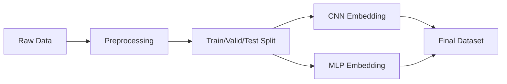
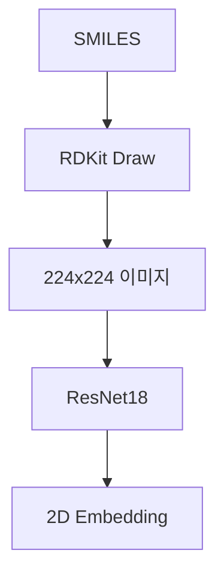
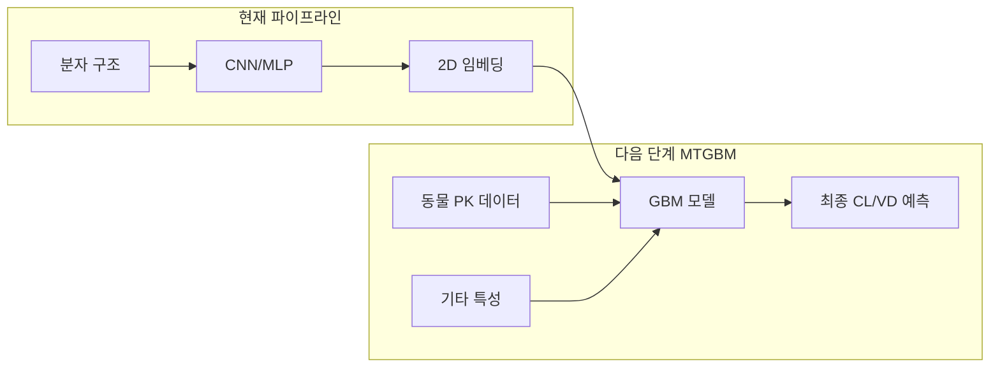
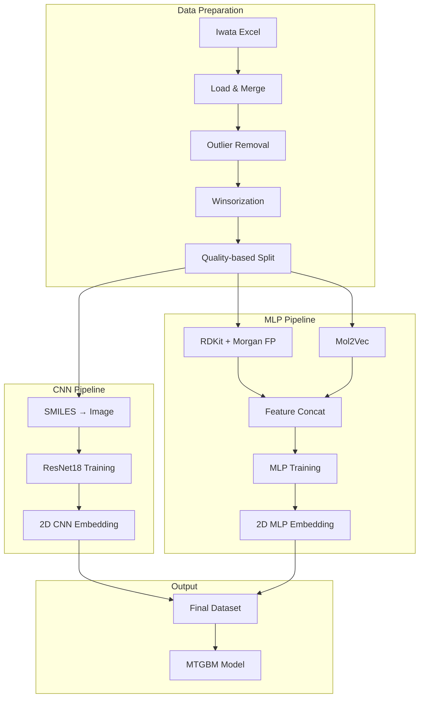

# MTGBM Iwata Data Pipeline

> **목적**: 약물의 약동학(PK) 파라미터 예측을 위한 Multi-Task Gradient Boosting Machine (MTGBM) 모델의 데이터 준비 파이프라인

---

## 📋 개요

이 파이프라인은 Iwata 데이터셋을 활용하여 약물의 **Clearance (CL)**와 **Volume of Distribution (VDss)** 예측을 위한 딥러닝 임베딩을 생성합니다.

### 주요 구성요소



---

## 🔧 1. Environment Setup

### 필수 패키지

| 카테고리      | 패키지                    | 용도         |
| --------- | ---------------------- | ---------- |
| **기본**    | numpy, pandas          | 데이터 처리     |
| **딥러닝**   | tensorflow, torch      | 모델 학습      |
| **최적화**   | optuna                 | 하이퍼파라미터 튜닝 |
| **화학정보학** | rdkit, mol2vec, gensim | 분자 특성 추출   |

### 설치 코드

```python
# numpy 호환 버전 설치 (mol2vec 호환성)
!pip install "numpy>=1.23.0,<2.0"
!pip install tensorflow optuna rdkit gensim
!pip install git+https://github.com/samoturk/mol2vec
```

> [!warning] 주의사항
> - numpy 2.0 이상 버전은 mol2vec/gensim과 호환되지 않음
> - 패키지 설치 후 **Runtime Restart** 필수

---

## 📊 2. Data Loading & Merging

### 데이터 소스

- **파일**: `ci2c00318_si_002.xlsx` (Iwata et al. 논문 Supplementary)
- **시트 구성**:
  - `CL_matched`: Clearance 데이터
  - `VD_matched`: Volume of Distribution 데이터

### 병합 로직

```python
def load_and_merge_iwata_data(file_path):
    """
    CL과 VD 데이터를 분자 이름(NAME) 기준으로 병합
    - 공통 컬럼은 중복 제거
    - Inner join으로 두 데이터 모두 존재하는 화합물만 유지
    """
```

### 결과

| 항목     | 값        |
| ------ | -------- |
| 원본 데이터 | 722개 화합물 |
| 컬럼 수   | 18개      |

---

## 🧹 3. Data Preprocessing

### 이상치 처리 전략

#### Step 1: 극단값 제거

```python
# 약리학적으로 비현실적인 값 제거
condition = (df['human_VDss_L_kg'] >= 5) | (df['human_CL_mL_min_kg'] >= 20)
df_filtered = df[~condition]
```

- **CL ≥ 20 mL/min/kg**: 제거
- **VDss ≥ 5 L/kg**: 제거

#### Step 2: Winsorization

```python
# 1st ~ 99th percentile로 클리핑
for col in numeric_cols:
    lower = df[col].quantile(0.01)
    upper = df[col].quantile(0.99)
    df[col] = np.clip(df[col], lower, upper)
```

### 결과

| 단계 | 샘플 수 |
|-----|---------|
| 원본 | 722 |
| 전처리 후 | 581 |

---

## 📐 4. Data Split Strategy

### 품질 기반 분할

일반적인 랜덤 분할 대신 **분포 유사성**을 최적화하는 방법 사용

#### 평가 메트릭

| 메트릭 | 가중치 | 설명 |
|--------|--------|------|
| Kruskal-Wallis p-value | 0.30 | 분포 유사성 검정 |
| Range Similarity | 0.25 | 범위 유사성 |
| IQR Similarity | 0.20 | 사분위 범위 유사성 |
| Outlier Distribution | 0.15 | 이상치 분포 균등성 |
| Percentile Similarity | 0.10 | 백분위수 분포 유사성 |

#### 분할 비율

```
Train : Valid : Test = 60% : 20% : 20%
```

#### 알고리즘

```python
def create_robust_splits(df, max_attempts=100):
    """
    100개의 랜덤 시드로 분할 수행 후
    Composite Score가 가장 높은 분할 선택
    """
    for seed in range(max_attempts):
        # 분할 생성
        # 품질 메트릭 계산
        # 최고 점수 업데이트
```

### 최종 분할 결과

| Split | 샘플 수 |
|-------|---------|
| Train | 348 |
| Valid | 116 |
| Test | 117 |
| **Total** | **581** |

---

## 🖼️ 5. CNN Embedding Generation

### 아키텍처: ResNet18

분자 구조 이미지로부터 시각적 특징 추출



### 주요 컴포넌트

#### MoleculeImageDataset

```python
class MoleculeImageDataset(Dataset):
    """
    - SMILES → 분자 이미지 변환
    - 224x224 리사이즈
    - RGB 텐서 변환
    """
```

#### 모델 구조

```python
class ResNetEmbeddingModel(nn.Module):
    """
    ResNet18 (pretrained) 
    → FC Layer (512 → units)
    → Embedding Layer (units → 2)  # 2D 임베딩
    → Output Layer (2 → 1)         # 예측값
    """
```

### 하이퍼파라미터 탐색 (Optuna)

| 파라미터 | 탐색 범위 |
|---------|----------|
| units | [32, 64, 128, 256] |
| dropout | 0.0 ~ 0.5 |
| learning_rate | 1e-5 ~ 1e-3 |
| batch_size | [8, 16, 32] |
| epochs | 10 ~ 100 |

### 학습 프로세스

```
STEP 1: Optuna로 하이퍼파라미터 최적화 (30 trials)
        - train + valid + early stopping
        
STEP 2: 최적 하이퍼파라미터로 최종 모델 학습
        - train + valid 합쳐서 학습
        
STEP 3: 임베딩 추출
        - hidden_emb 레이어에서 2D 벡터 추출
```

### 출력 컬럼

- `cnn_vec1_CL`, `cnn_vec2_CL`: CL 모델 임베딩
- `cnn_vec1_VD`, `cnn_vec2_VD`: VD 모델 임베딩

---

## 🧠 6. MLP Embedding Generation

### 입력 특성

#### RDKit Descriptors (5개)

| Descriptor | 설명 |
|-----------|------|
| MolWt | 분자량 |
| MolLogP | 지용성 (LogP) |
| NumHDonors | 수소결합 공여체 수 |
| NumHAcceptors | 수소결합 수용체 수 |
| TPSA | 극성 표면적 |

#### Morgan Fingerprint (256 bits)

```python
morgan_gen = rdFingerprintGenerator.GetMorganGenerator(radius=2, fpSize=256)
fp = morgan_gen.GetFingerprint(mol)
```

#### Mol2Vec Embedding (300D)

```python
def smiles_to_mol2vec(smiles):
    """
    사전 훈련된 Word2Vec 모델로 
    분자를 300차원 벡터로 변환
    """
    sentence = mol2alt_sentence(mol, radius=1)
    vecs = [model.wv[word] for word in sentence]
    return np.mean(vecs, axis=0)
```

### 총 입력 차원

```
5 (RDKit) + 256 (Morgan FP) + 300 (Mol2Vec) = 561 차원
```

### MLP 아키텍처

```python
Input (561D)
    ↓
Dense (units, ReLU) × n_layers
    ↓ (+ Dropout)
Hidden Embedding (2D)  ← 여기서 임베딩 추출
    ↓
Output (1D)
```

### 하이퍼파라미터 탐색

| 파라미터 | 탐색 범위 |
|---------|----------|
| n_layers | 1 ~ 3 |
| units | [32, 64, 128, 256] |
| dropout | 0.0 ~ 0.5 |
| lr | 1e-4 ~ 1e-2 |
| optimizer | [adam, rmsprop] |
| batch_size | [16, 32, 64] |
| epochs | 50 ~ 1000 |

### 최적화 결과 예시

#### CL 모델

```yaml
Best validation loss: 0.8155
n_layers: 2
units: 64
dropout: 0.3
lr: 0.00149
opt: adam
batch_size: 16
epochs: 350
```

#### VD 모델

```yaml
Best validation loss: 0.6168
n_layers: 1
units: 64
dropout: 0.2
lr: 0.00186
opt: adam
batch_size: 16
epochs: 590
```

### 출력 컬럼

- `mlp_vec1_CL`, `mlp_vec2_CL`: CL 모델 임베딩
- `mlp_vec1_VD`, `mlp_vec2_VD`: VD 모델 임베딩

---
## CNN/MLP 모델의 역할

### 예측 타겟 (Y)

|모델|예측 대상|
|---|---|
|CL 모델|`human_CL_mL_min_kg` (청소율)|
|VD 모델|`human_VDss_L_kg` (분포용적)|

### 진짜 목적: 임베딩 추출

CNN/MLP 모델의 **최종 예측값은 사용하지 않습니다.**

대신, 학습된 모델의 **중간 레이어(hidden_emb)**에서 2D 벡터를 추출합니다:

```
Input → [Hidden Layers] → hidden_emb (2D) → Output (1D)
                              ↑
                         여기서 추출!
```

---

## 생성된 설명변수 (Features)

| 소스      | 변수명                          | 차원  | 설명                       |
| ------- | ---------------------------- | --- | ------------------------ |
| **CNN** | `cnn_vec1_CL`, `cnn_vec2_CL` | 2D  | CL 예측 모델에서 학습된 분자 이미지 특징 |
| **CNN** | `cnn_vec1_VD`, `cnn_vec2_VD` | 2D  | VD 예측 모델에서 학습된 분자 이미지 특징 |
| **MLP** | `mlp_vec1_CL`, `mlp_vec2_CL` | 2D  | CL 예측 모델에서 학습된 화학적 특징    |
| **MLP** | `mlp_vec1_VD`, `mlp_vec2_VD` | 2D  | VD 예측 모델에서 학습된 화학적 특징    |

**총 8개의 새로운 설명변수** 생성

---

## 왜 이렇게 하나요?

mermaid



이 임베딩들은 **Transfer Learning** 개념입니다:

1. **CNN**: 분자 "이미지"에서 시각적 구조 패턴 학습
2. **MLP**: 분자 "수치적 특성"에서 화학적 패턴 학습
3. **MTGBM**: 이 임베딩 + 동물 PK 데이터 등을 결합하여 최종 예측

---

## 요약

|질문|답변|
|---|---|
|CNN이 예측한 것?|CL과 VD (하지만 예측값 자체는 사용 안 함)|
|만든 설명변수?|학습된 모델의 중간 레이어에서 추출한 **8개의 2D 임베딩 벡터**|
|용도?|MTGBM 모델의 입력 특성으로 사용|
## ✅ 7. Quality Control

### 임베딩 검증 항목

1. **결측치 확인**: 모든 샘플에 임베딩 존재 여부
2. **분포 분석**: 히스토그램, 박스플롯, Q-Q 플롯
3. **상관관계 분석**: 임베딩 간 상관계수
4. **이상치 탐지**: 극단적 임베딩 값 확인

### 최종 검증 결과

```
No major issues detected in MLP embeddings!
Data completion rate: 100.00% (581/581)
Excellent: High completion rate
```

---

## 📁 8. Output Files

### 저장 경로

```
/content/drive/MyDrive/mtgbm/data/
```

### 파일 목록

| 파일명                            | 설명              |
| ------------------------------ | --------------- |
| `processed_data_scaled.csv`    | 전처리 + 스케일링된 데이터 |
| `data_with_cnn_embeddings.csv` | CNN 임베딩 포함      |
| `data_with_mlp_embeddings.csv` | MLP 임베딩 포함      |

### 최종 데이터 구조

| 컬럼 유형 | 컬럼명 |
|----------|--------|
| **식별** | NAME, mol, split |
| **타겟** | human_CL_mL_min_kg, human_VDss_L_kg |
| **CNN 임베딩** | cnn_vec1_CL, cnn_vec2_CL, cnn_vec1_VD, cnn_vec2_VD |
| **MLP 임베딩** | mlp_vec1_CL, mlp_vec2_CL, mlp_vec1_VD, mlp_vec2_VD |
| **기타 특성** | 동물 PK 파라미터 등 |

---

## 🔄 9. 파이프라인 요약



---

## 📚 참고문헌

- **Iwata et al.**: 원본 약동학 데이터 출처
- **Mol2Vec**: Jaeger et al., J. Chem. Inf. Model. 2018
- **RDKit**: Open-source cheminformatics
- **Optuna**: Akiba et al., KDD 2019

---

## 🏷️ Tags

#MTGBM #PK예측 #딥러닝 #약동학 #CL #VDss #CNN #MLP #Mol2Vec #RDKit #Optuna

---

*Last Updated: 2025-01-XX*
*Author: Dave (CHA University)*
