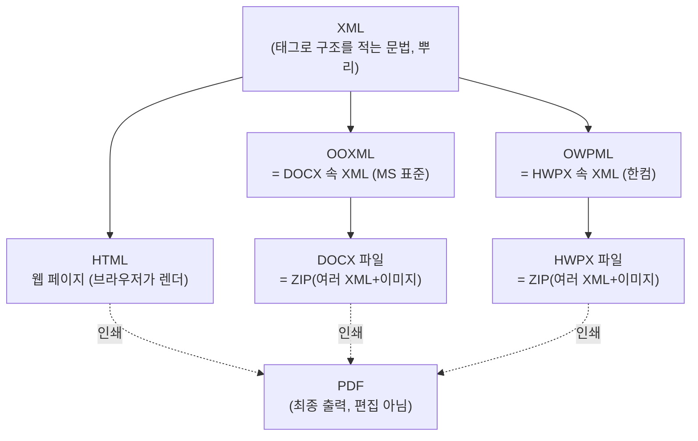
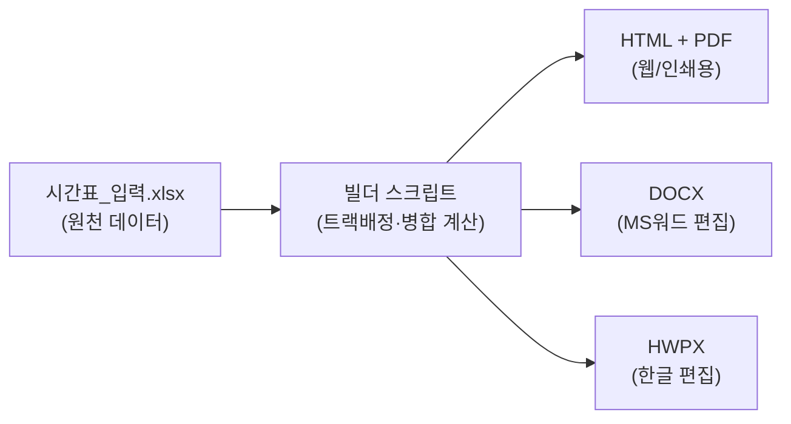

# 문서 포맷의 관계 — HTML · XML · DOCX · HWPX

> **한 줄 요약** · 넷 다 "텍스트로 쓴 마크업"이다.
> **DOCX와 HWPX는 사실상 형제**(둘 다 *ZIP 안에 든 XML*), **HTML은 사촌**, **XML은 이 셋의 공통 문법**.
> 그런데도 변환이 어려운 건 *방언(스키마)*이 다르고, HWPX는 비공개 + 렌더 캐시 같은 구현 특이사항 때문이다.

---

## 1. 한 장으로 보는 관계



- **XML** = 규칙(문법). 그 위에 HTML·OOXML·OWPML이라는 **방언**이 있다.
- **DOCX/HWPX** = 그 방언으로 쓴 XML들을 **ZIP으로 묶은 꾸러미**. (확장자를 `.zip`으로 바꿔 풀어보면 안이 보인다.)
- **HTML** = 보통 **한 개의 텍스트 파일**. 브라우저가 즉석에서 그려준다.
- **PDF** = 위 셋을 "인쇄"한 **사진 같은 결과물**. 다시 편집하긴 어렵다(우리 시스템에선 최종 산출용).

---

## 2. XML — 모든 것의 뿌리

태그로 "이건 제목, 이건 표, 이 칸의 글자색은 파랑" 식으로 **구조와 의미**를 적는 문법.

```xml
<문서>
  <제목>안녕</제목>
  <문단>본문입니다</문단>
</문서>
```

HTML·DOCX(OOXML)·HWPX(OWPML)는 전부 이 문법의 **구체적 방언**일 뿐이다. 태그 이름과 규칙만 다르다.

---

## 3. 같은 "표 한 칸"을 네 포맷으로

같은 내용 *(셀에 "재무관리")* 이 포맷마다 이렇게 적힌다 — 닮았지만 방언이 다르다.

| 포맷 | 표현 (요지) |
|---|---|
| **HTML** | `<td style="background:#cfe9da">재무관리</td>` |
| **DOCX** (OOXML) | `<w:tc><w:tcPr><w:shd w:fill="CFE9DA"/></w:tcPr><w:p><w:r><w:t>재무관리</w:t></w:r></w:p></w:tc>` |
| **HWPX** (OWPML) | `<hp:tc borderFillIDRef="6"><hp:subList><hp:p><hp:run><hp:t>재무관리</hp:t></hp:run></hp:p></hp:subList>…</hp:tc>` |
| **PDF** | (텍스트 "재무관리"를 좌표 (x,y)에 글자크기 9pt로 그려라 — 구조 없음) |

핵심 차이:
- HTML은 **색을 셀에 직접** 적는다(`style`).
- DOCX/HWPX는 **색을 따로 정의(스타일 표)** 해두고 셀은 그 **번호만 참조**한다(`w:shd` vs `borderFillIDRef`). → 그래서 HWPX는 `header.xml`에 색·글자모양을 등록하고 본문은 ID로 가리킨다.
- PDF는 **의미가 없다**. "어디에 무슨 글자를 찍어라"만 있어 되돌려 편집하기 어렵다.

---

## 4. 그래서 왜 변환이 어렵고 오래 걸렸나

형제·사촌이라도 **자동 변환이 깔끔하지 않은** 이유:

1. **방언(스키마)이 다르다** — 표·병합·스타일을 가리키는 태그/규칙이 제각각이라 1:1로 안 맞는다.
2. **HWPX는 비공개** — OOXML(docx)은 국제표준이라 도구가 많지만, OWPML(hwpx)은 한컴 전용이라 **문서가 부족** → 실제 파일을 뜯어 **역공학**해야 한다.
3. **이 PC 환경에선 변환 자체가 막힘** — 한컴오피스 자동화(COM)가 docx/rtf 열기에 실패(변환 필터 미설치 추정). 그래서 "변환" 대신 **"직접 생성"** 으로 우회.
4. **HWPX의 숨은 함정들** — 글자배치 캐시(`linesegarray`)를 비워두면 한글이 "열 때" 다시 계산해야 보이고(→ baking 필요), 글자크기 필드가 0이면 0.12pt로 찍히고, 가로 방향·인쇄폭 규칙이 직관과 반대.

> 즉 시간이 걸린 건 *포맷이 근본적으로 달라서*가 아니라, **비공개 포맷을 뜯어 규칙을 알아내고 함정을 하나씩 피해야** 했기 때문. 한 번 정리해 둔 지금은 **재사용**으로 빨라진다([[index|HWPX 자동 생성 가이드]] · 스킬 `hwpx`).

---

## 5. 우리 시스템에서의 위치 — 하나의 데이터, 여러 출력



데이터는 **엑셀 한 곳**에만 있고, 빌더가 같은 데이터를 **네 포맷으로** 찍어낸다.
→ 엑셀만 고치고 다시 돌리면 모든 포맷이 갱신된다. (포맷별로 따로 손댈 필요 없음)

---

## 6. 언제 무엇을 쓰나

| 상황 | 추천 |
|---|---|
| 웹에 올리기 / 빠른 미리보기 | **HTML** (+필요시 PDF) |
| 메일 첨부·인쇄·제출용 고정본 | **PDF** |
| MS워드로 같이 편집 | **DOCX** |
| 한글(HWP)로 같이 편집·공문 | **HWPX** |
| 데이터가 자주 바뀜 | 원천은 **XLSX**, 출력은 위에서 골라 자동생성 |

---

> 관련: [[index|HWPX 자동 생성 가이드 (v6)]]
